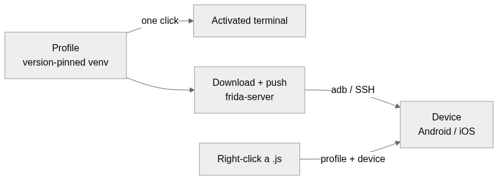

# Frivenv — a VS Code extension for Windows

**Keep one Python venv per Frida version, and push the matching `frida-server` to
your rooted Android and jailbroken iOS devices. Switch versions without ever
rebuilding a venv.**

**English · [한국어](README.ko.md)**

## Install

Frivenv isn't on the Marketplace, so install the `.vsix` by hand — two steps.

### 1. Download `frivenv.vsix`

On the [latest release](https://github.com/xorren/frivenv/releases/latest) page,
click the `frivenv.vsix` asset — or run one line in a terminal:

Command Prompt (cmd):
```
curl -LO https://github.com/xorren/frivenv/releases/download/v0.0.1/frivenv.vsix
```
PowerShell:
```
curl.exe -LO https://github.com/xorren/frivenv/releases/download/v0.0.1/frivenv.vsix
```

### 2. Install it

From the folder where the file landed:

```
code --install-extension frivenv.vsix
```

Or, no terminal: VS Code → Extensions (`Ctrl+Shift+X`) → `···` → **Install from
VSIX** → pick `frivenv.vsix`.

## Features



- **Profiles** — one venv per `frida` / `frida-tools` / Python; only compatible `frida-tools` offered.
- **frida-server** — download, push, start, stop, delete — per registered device.
- **Run script** — right-click a `.js`, pick profile and device; warns on a version mismatch.
- **Devices** — Android over `adb`, jailbroken iOS over SSH; nicknames, live status, file pull, APK install, sideloaded-app IPA pull (iOS).

## Requirements

| Need | For |
| --- | --- |
| **Windows** · **VS Code 1.85+** | the extension itself |
| **`py`** launcher | creating profiles (virtualenvs) |
| **`adb`** | Android devices — *iOS needs nothing; SSH is built in* |

Missing `py` / `adb` is flagged in the sidebar with an install link.

## Settings

Listed in the order they appear in VS Code's settings screen.

| Setting | Default | |
| --- | --- | --- |
| `frivenv.language` | `auto` | `auto` follows VS Code; `ko` / `en` to force |
| `frivenv.showInExplorer` | `true` | show the trees under one **Frivenv** section in the Explorer (turn off to use only the activity-bar view) |
| `frivenv.pythonLauncherPath` | PATH | path to `py` (auto-detected on first run) |
| `frivenv.adbPath` | PATH | path to `adb` (auto-detected on first run) |
| `frivenv.dataDir` | extension storage | profiles + virtualenvs |
| `frivenv.scriptsDir` | open workspace folder | where a profile terminal opens, so `frida -l hook.js` stays short |
| `frivenv.iosFridaServerDir` | auto | folder on the iOS device to install frida-server into; leave blank to auto-detect (rootless `/var/jb/usr/sbin` vs rootful `/usr/sbin`) |

## Build

```powershell
npm install
npm run package   # -> frivenv.vsix
```

`npm run compile` / `watch` / `check` for dev; F5 launches a debug host.

## Notes

iOS SSH passwords are stored in plaintext in `ios-devices.json`. UI is EN/KO;
code and comments are English. MIT.
